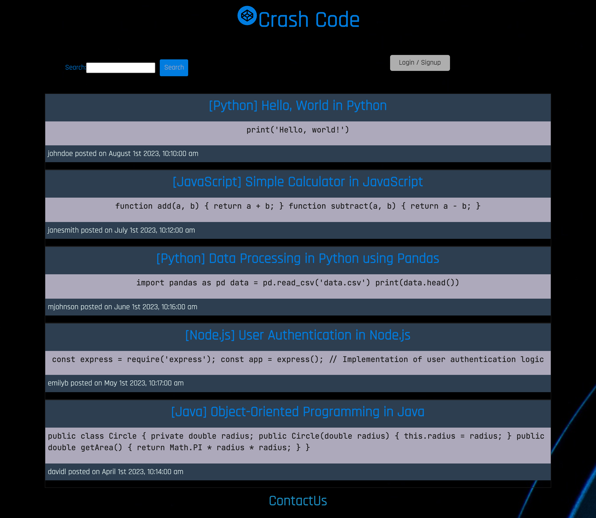

# Crashcode

## Description
Our mission was simple: See if we could take something we knew and re-create it. With Crash Code, we removed all the unwanted noise of ads, and kept it simple.

With Crash Code you can create a profile, and start posting your code snippets. You can also view other users' code snippets, and even comment on them!

## Table of Contents
- [License](#license)
- [Contributing](#contribution)
- [Preview](#previews)
- [Links](#links)
- [Credits](#credits)
- [Questions](#questions)
   
## License
This project is licensed under the MIT license.
  
## Contribution
Want to contribute? That's awesome! Please fork the repo and add your changes. If you find any bugs or have any suggestions, please let one of us know! Would would love to hear for from you. 
  
## Preview

## Links
**Github Repo:** [Link to Github repository!](https://github.com/kimmh891223/crashcode)  
**Heroku App:** [Link to the Heroku App!](https://crashcode-075d0f3975bd.herokuapp.com/)  

## Credits
**Instructor(s):** Ali Maqsood  
**Assistant Instructor(s):** Shihan, Adam, Krishna, & Tareque Moatar  
**Institution:** University of Toronto  
**Team Members:** Abhishek Desai, Min Hwan Kim, Russell Caballero, Alice Liu, and Jung In Kim 

## Resources
1. https://react.dev/
2. https://reactrouter.com/
3. https://www.npmjs.com/package/react-icons
4. https://react-icons.github.io/react-icons/ 
5. https://getbootstrap.com/
6. https://stackoverflow.com/ 

## Questions
If you have any questions regarding the repo, check with us through our Github profile:
1. Min Hwan Kim: https://github.com/kimmh891223
2. Jung In Kim: https://github.com/Heaveness
3. Alice Liu: https://github.com/AliceLiu1218
4. Abhishek: https://github.com/Abhidesai508
5. Russell Caballero: https://github.com/caballero-r